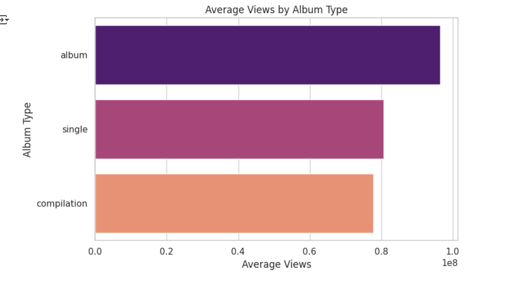
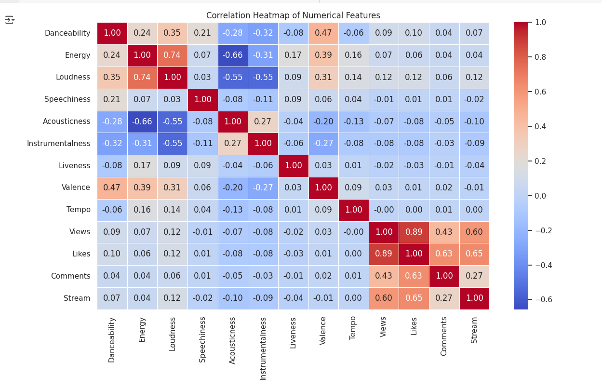
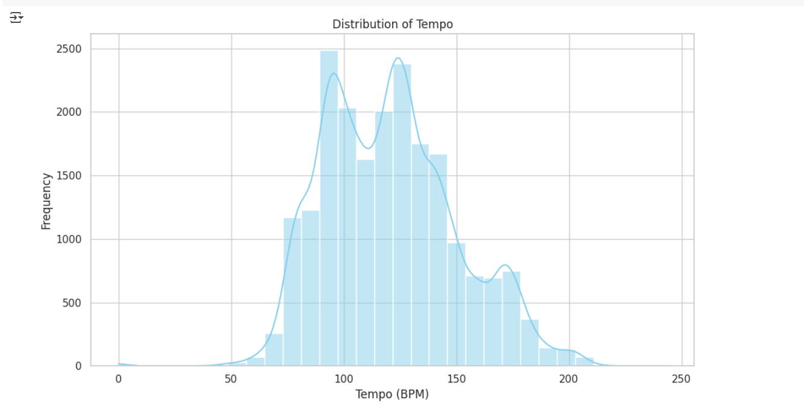
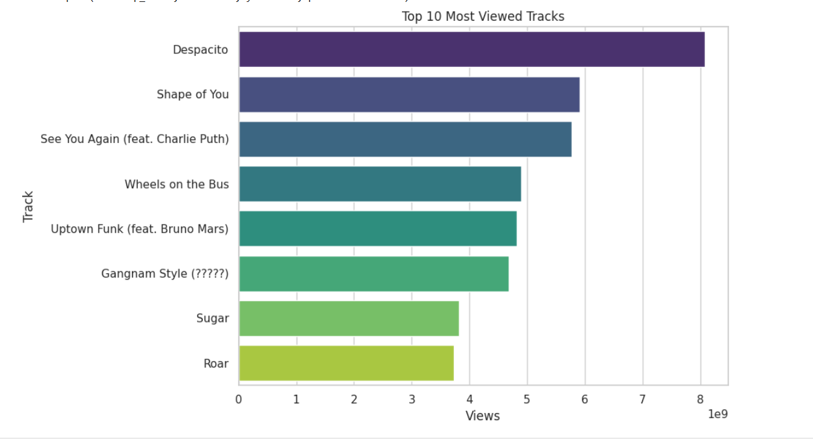

# 🎧 Spotify SQL Analysis Project

This project explores and analyzes a Spotify dataset using **SQL** and **Python**. It focuses on musical attributes, popularity metrics, and performance insights, helping to understand trends and listener behavior.

## 🔍 Features

- Analysis of key musical features: `danceability`, `energy`, `tempo`, `valence`, etc.
- Popularity metrics: `views`, `likes`, `comments`, and `streams`
- SQL subqueries and aggregate functions (SUM, AVG)
- Views and indexing for optimized querying
- Correlation analysis using Python (Pandas + Seaborn)
- Visualizations: heatmaps, histograms, and more

## 📁 Project Structure

- `Spotify_SQL.ipynb` – Jupyter notebook with SQL queries and Python visualizations
- `cleaned_dataset.csv` – Cleaned dataset used for analysis
- SQL Views: `top_tracks`, `basic_track_info`
- Python Visuals: distribution plots, correlation heatmaps

## 🛠️ Tools Used

- **SQL (PostgreSQL)** – Used for querying, creating views, and aggregations  
  🔗 [PostgreSQL](https://www.postgresql.org/)

- **Python (Pandas, Seaborn, Matplotlib)** – Used for data analysis and visualizations  
  🔗 [Pandas](https://pandas.pydata.org/)  
  🔗 [Seaborn](https://seaborn.pydata.org/)  
  🔗 [Matplotlib](https://matplotlib.org/)

- **Google Colab** – For cloud-based Python execution and visualizations  
  🔗 [Google Colab](https://colab.research.google.com/)

- **Git & GitHub** – For version control and project collaboration  
  🔗 [Git](https://git-scm.com/)  
  🔗 [GitHub](https://github.com/)

## 🚀 How to Run

### ▶️ Google Colab
1. Clone the repository  
2. Open `Spotify_SQL.ipynb` in Google Colab 
3. Connect to your SQL environment  
4. Run the cells to explore the data and visualizations

### 🛠️ How to Run the SQL File (PostgreSQL)

1. **Download** the `.sql` file from this repository.
2. Open **pgAdmin** or your preferred PostgreSQL tool.
3. **Create a new database** (right-click on Databases → New Database).
4. Once created, **right-click on the new database**, choose **"Restore"**.
5. In the restore dialog, select the downloaded `.sql` file.
6. Click **Restore**.
7. The database will now be populated — you can start running queries!

## 📸 Sample Output

#### 🎯 Average Views

#### 🔥 Correlation Heatmap

#### 🎵 Distribution of Tempo

#### 👑 Most Viewed Tracks

## 🧠 Key Learnings

- Learned how to explore real-world music data using SQL and Python.
- Gained experience writing efficient SQL queries including `JOIN`, `GROUP BY`, `VIEWS`, and subqueries.
- Used aggregate functions and indexing to improve performance.
- Visualized complex data patterns using Python libraries like Seaborn and Matplotlib.
- Practiced database restoration and Git version control for data projects.
--
