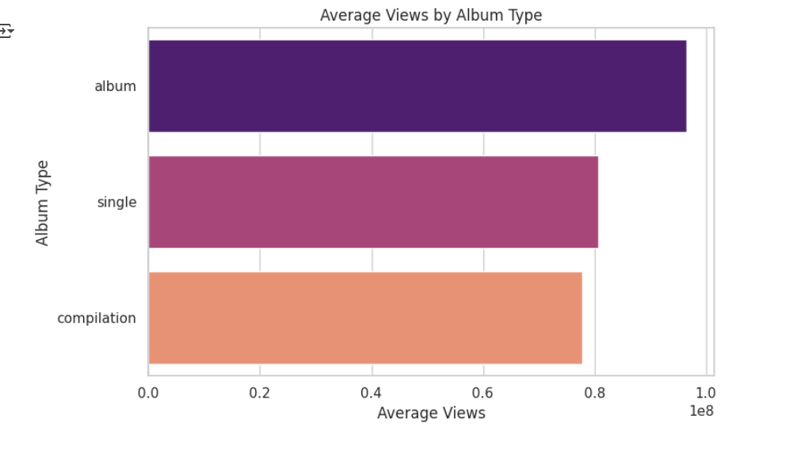

# 🎵 Spotify SQL Data Analysis

This project explores and analyzes a Spotify dataset using **SQL** and **Python**. It focuses on musical attributes, popularity metrics, and performance insights, helping to understand trends and listener behavior.

## 🔍 Features

- Analysis of key musical features: `danceability`, `energy`, `tempo`, `valence`, etc.
- Popularity metrics: `views`, `likes`, `comments`, and `streams`
- SQL subqueries and aggregate functions (SUM, AVG)
- Views and indexing for optimized querying
- Correlation analysis using Python (Pandas + Seaborn)
- Visualizations: heatmaps, histograms, and more

## 📁 Project Structure

- `Spotify_SQL.ipynb` – Jupyter notebook with SQL queries and Python visualizations
- `cleaned_dataset.csv` – Cleaned dataset used for analysis
- SQL Views: `top_tracks`, `basic_track_info`
- Python Visuals: distribution plots, correlation heatmaps

## ⚙️ Tools Used

- PostgreSQL / SQLite
- Python (Pandas, Seaborn, Matplotlib)
- Jupyter Notebook
- Git & GitHub

## 🚀 How to Run

### ▶️ Jupyter Notebook
1. Clone the repository  
2. Open `Spotify_SQL.ipynb` in Jupyter Notebook  
3. Connect to your SQL environment  
4. Run the cells to explore the data and visualizations

### 🛠️ How to Run the SQL File (PostgreSQL)

1. **Download** the `.sql` file from this repository.
2. Open **pgAdmin** or your preferred PostgreSQL tool.
3. **Create a new database** (right-click on Databases → New Database).
4. Once created, **right-click on the new database**, choose **"Restore"**.
5. In the restore dialog, select the downloaded `.sql` file.
6. Click **Restore**.
7. The database will now be populated — you can start running queries!

## 📸 Sample Output

### 🎯 Correlation Heatmap  

### 📊 Tempo Distribution

### 🔥 Top Streamed Tracks

## 📬 Contact

Created by [Zakir-ai](https://github.com/Zakir-ai)  
Feel free to raise issues or contribute!
